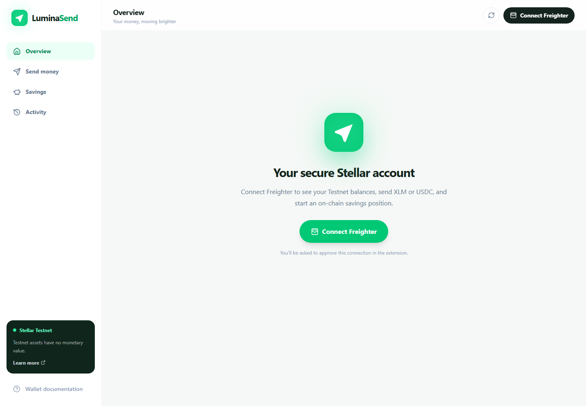

# LuminaSend

LuminaSend is a non-custodial cross-border payment and earning application on
Stellar Testnet. Users connect Freighter, send XLM or USDC, inspect real account
activity, and choose between Blend lending and Aquarius liquidity using the
same Circle Testnet USDC held in their wallet.

Every balance, rate, position, and transaction comes from Stellar. LuminaSend
does not store private keys, recovery phrases, user profiles, or financial
records.

## Product




### Live functionality

- Freighter wallet authorization with strict Testnet validation
- XLM, spendable XLM, and Circle Testnet USDC balances from Horizon
- Signed XLM and USDC payments submitted to Stellar Testnet
- Real payment and Soroban transaction history from Horizon
- Live Blend and Aquarius Circle-USDC APYs and wallet-owned positions
- Direct Blend supply and withdrawal transactions signed by the user
- Direct Aquarius USDC/XLM liquidity deposits and withdrawals
- Direct Stellar Expert links for transactions and contracts

## How earning works

Blend supplies Circle USDC to a lending pool where borrower interest increases
suppliers' positions. Aquarius pairs Circle USDC with XLM in an AMM, where
liquidity providers earn swap fees and accept price and impermanent-loss risk.
There is no LuminaSend-funded reward reserve and no fixed or promised rate.

The dashboard reads both rates from live protocol data and identifies the best
currently verified Circle-USDC option. A 5% target is never substituted for a
real network rate. Testnet assets and reported Testnet yields have no monetary
value.

## Network configuration

LuminaSend is intentionally restricted to Stellar Testnet.

| Resource | Address |
| --- | --- |
| Blend Regional Starter Pack | `CAPBMXIQTICKWFPWFDJWMAKBXBPJZUKLNONQH3MLPLLBKQ643CYN5PRW` |
| Aquarius Circle USDC/XLM pool | `CDVB6O3WX24AAZ77SQRN52ABU4ECB66N36FG5BFVPTV54DPG3V6MOTOD` |
| Circle Testnet USDC contract | `CBIELTK6YBZJU5UP2WWQEUCYKLPU6AUNZ2BQ4WWFEIE3USCIHMXQDAMA` |
| Circle Testnet USDC issuer | `GBBD47IF6LWK7P7MDEVSCWR7DPUWV3NY3DTQEVFL4NAT4AQH3ZLLFLA5` |

[Inspect the Blend pool on Stellar Expert](https://stellar.expert/explorer/testnet/contract/CAPBMXIQTICKWFPWFDJWMAKBXBPJZUKLNONQH3MLPLLBKQ643CYN5PRW).

## Architecture

```text
Freighter
  └─ authorizes transaction XDR
      └─ React + Vite application
          ├─ Horizon: balances, ledgers, payments, activity
          ├─ Stellar RPC: simulation and Soroban submission
          ├─ Blend lending pool: wallet-owned Circle-USDC position
          └─ Aquarius AMM: wallet-owned Circle-USDC/XLM LP position
```

The project was initialized with Scaffold Stellar and uses React 19,
TypeScript, Vite, Tailwind CSS, `@stellar/stellar-sdk`,
`@stellar/freighter-api`, Blend's official JavaScript SDK, and Aquarius's
Soroban AMM contracts.

## Repository structure

```text
LuminaSend/
├── app/
│   ├── src/components/       Payment and lending transaction interfaces
│   ├── src/contexts/         Wallet context contract
│   ├── src/lib/              Stellar, Freighter, Blend, and Aquarius services
│   ├── src/pages/            Landing page and application dashboard
│   └── .env.example          Public Testnet configuration
├── docs/screenshots/         Product screenshots
├── environments.toml         Scaffold Stellar Testnet contracts
├── scaffold.yml              Scaffold Stellar workspace configuration
└── vercel.json               Vercel build, routing, and security headers
```

## Local development

### Prerequisites

- Node.js 22 or newer
- npm
- Freighter browser extension
- Freighter configured for Stellar Testnet

### Install and run

```bash
git clone https://github.com/Datwebguy/LuminaSend.git
cd LuminaSend
npm ci
cp app/.env.example app/.env
npm run dev
```

On Windows PowerShell:

```powershell
Copy-Item app/.env.example app/.env
npm.cmd run dev
```

Open `http://localhost:5173`.

## Environment variables

All variables are public network configuration. LuminaSend has no server-side
wallet and requires no application secret.

| Variable | Purpose |
| --- | --- |
| `PUBLIC_STELLAR_NETWORK` | Must be `TESTNET` |
| `PUBLIC_STELLAR_NETWORK_PASSPHRASE` | Stellar Testnet passphrase |
| `PUBLIC_STELLAR_RPC_URL` | Stellar RPC endpoint |
| `PUBLIC_STELLAR_HORIZON_URL` | Horizon endpoint |
| `PUBLIC_STELLAR_FRIENDBOT_URL` | Official Stellar Testnet funding endpoint |
| `PUBLIC_STELLAR_USDC_ISSUER` | Circle Testnet USDC issuer for payments |
| `PUBLIC_STELLAR_NATIVE_ASSET_CONTRACT_ID` | Native XLM asset contract |
| `PUBLIC_BLEND_POOL_ID` | Blend Regional Starter Pack pool |
| `PUBLIC_BLEND_USDC_CONTRACT_ID` | Circle Testnet USDC asset contract |
| `PUBLIC_AQUARIUS_API_URL` | Aquarius live Testnet pool API |
| `PUBLIC_AQUARIUS_POOL_ID` | Aquarius Circle-USDC/XLM pool |

The application validates required configuration at startup and refuses to run
with a non-Testnet passphrase.

## Verification

```bash
npm run lint
npm run typecheck
npm run build
```

## Deploy to Vercel

1. Import `Datwebguy/LuminaSend` into Vercel.
2. Leave the project root at the repository root.
3. Add every variable from `app/.env.example` in Project Settings →
   Environment Variables.
4. Deploy.

`vercel.json` uses `npm ci`, builds the Vite application, serves `app/dist`,
adds SPA fallback routing, and applies baseline browser security headers.
Never add private keys, local identities, or `.env` files to Vercel.

## Security model

- The browser never requests or stores a secret key.
- Freighter signs every payment, supply, liquidity deposit, and withdrawal.
- Positions are recorded by Blend or Aquarius for the user's wallet address.
- LuminaSend has no custody account and no withdrawal authority.
- Network checks prevent cross-network signing.
- Recipient addresses and Circle USDC trustlines are validated before payment.

Please report security concerns according to [SECURITY.md](SECURITY.md).

## Creator

LuminaSend is created and maintained by
[Datweb3guy](https://x.com/Datweb3guy).

Public Stellar address:
`GBCNH3PNORW5K4GMVIMT5RQEUZZL7IHPCYF2X2HHKNIAILBCKDWBUM65`

## License

Apache 2.0
